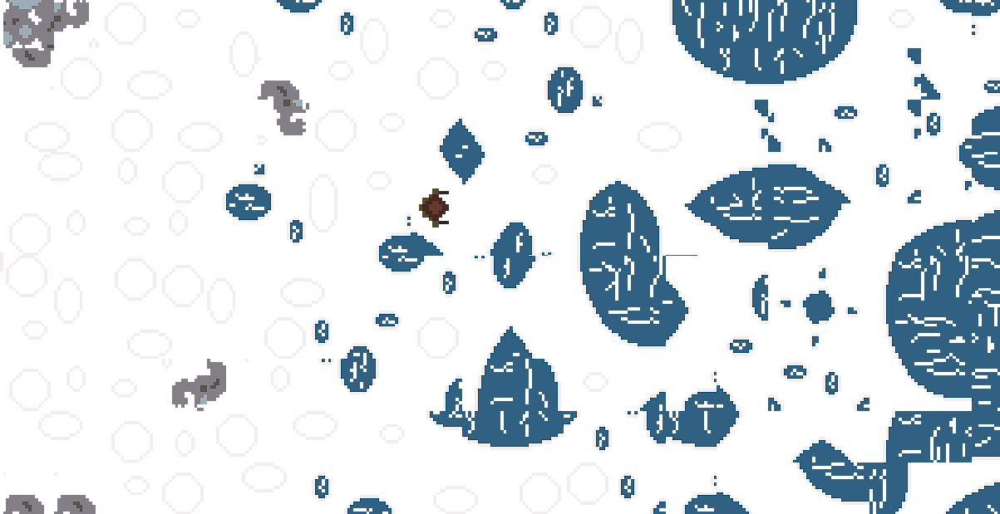
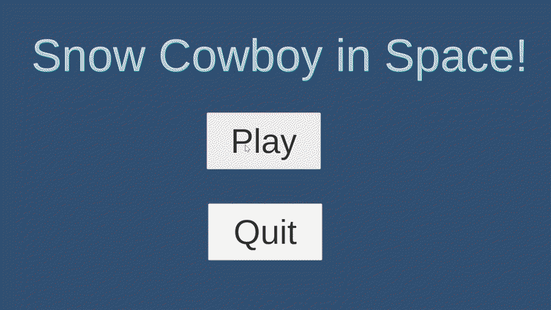

 # Snow Cowboy Top Down Shooter

<!--  -->

## Background
In my game you play as a space cowboy stranded on a snowy planet trying to survive battling alien creatures. My game was made for a University project so thats why its finished as kinda janky.

## How I made my game
Heres a one page document explaining how I made my game :
https://docs.google.com/document/d/13_BNucopCzuLIocq51rffvjzBsuOYFt5cVnqvE78ygs/edit?tab=t.0

## How to play my game 

My game can be played on Windows by running the application in BuiltGameV7

My game can also be played on itch (doesnt quite look as good) here:

https://starkbrix.itch.io/cozy-snow-space-cowboy

## Contribution
Other people can contribute by letting me know what they like to see or using the project files to expand the world with more mechanics, animals, or biomes.

I would want to improve the aliens design, the feel of shooting and making the effects more reactive.

## AI
I did not use AI at all to create the game or the assets 

